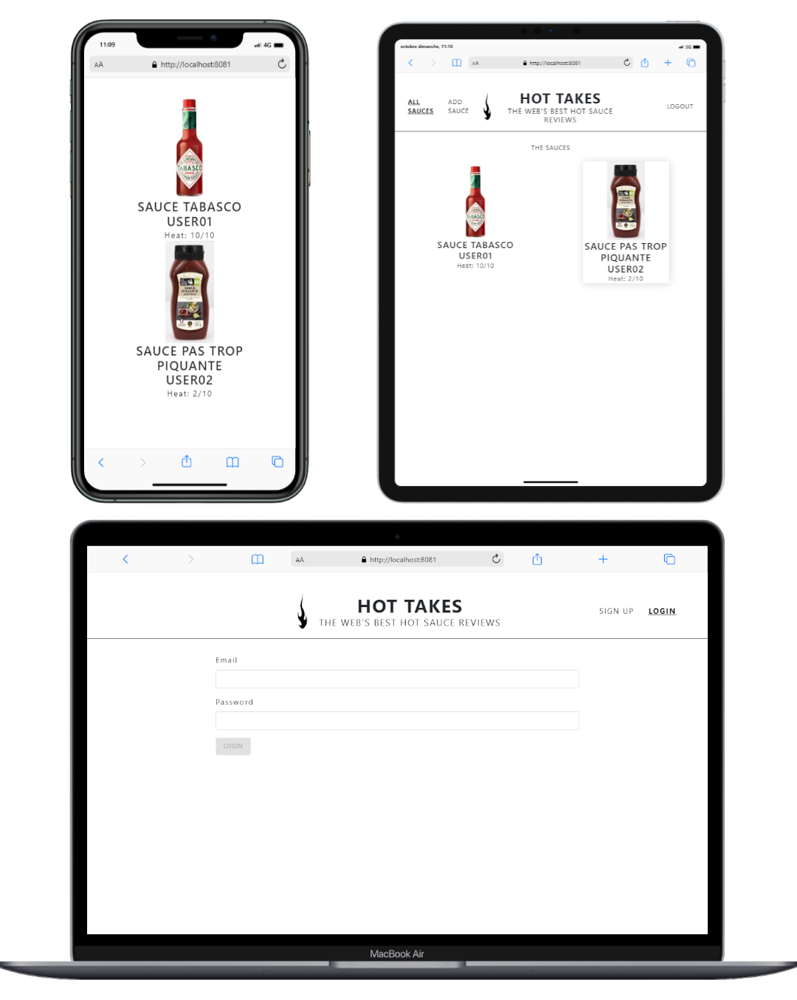

# OpenClassrooms Projet 06 
## Construisez une API sécurisée pour une application d'avis gastronomiques

## Pour tester l'application
1. Cloner le repository
    - Deux dossiers (backend / frontend)
2. backend :
    - Dans le terminal accéder au dossier du projet backend
    - Un exemple de variable d'environnement est fournis avec un accès restreint à la bdd, tous les renseignements sont déjà renseigné, il suffit simplement de supprimer (.example de => .env.example).
    - npm install (Pour les modules nodes)
    - lancer : "nodemon server","node server" ou "npm start";
3. Adresse de l'API : http://localhost:3000 par defaut
4. frontend : 
    - Dans le terminal accéder au dossier du projet frontend
    - npm install (Pour les modules nodes)
    - lancer : "npm start" ;
5. Adresse de l'API : http://127.0.0.1:8081

